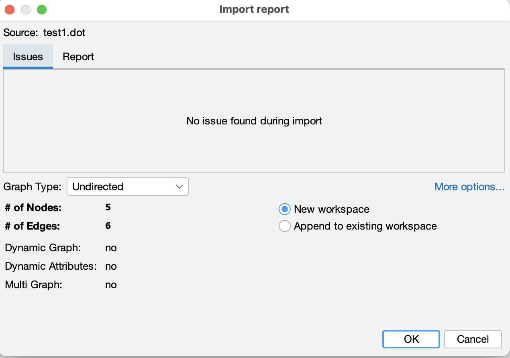

# Graph visualization and metrics with Gephi

In your second collaborative notebook, you created a social network, and saved a representation of the network in a file on your computer in DOT format.

For Monday, test the validity of your DOT file by opening it in Gephi.  If you import is successful, you will see a summary screen that reports the type of graph (directed or undirected), and the number of nodes and edges in the graph. Take a screen shot, and submit this image to your folder on the course Google Drive.

For example, if I author a tiny graph like this by hand in DOT format:

```
graph gods {
    Zeus -- Hera
    Hera -- Athena
    Zeus -- Athena
    Zeus -- Apollo
    Apollo -- Artemis
    Apollo -- Athena
}
```

when I open the file in Gephi, I see this summary:



You can see that the hand-written file is an undiretecd graph with 5 nodes and 6 edges.

For Tuesday's class, be prepared to interpret these simple numbers:  

1. What do these observations (numbers of edges and nodes in your graph) suggest about the text you examined?  
2. Are these observations consistent with other observations you've made about your text in other course work?